# rancher/kuberlr-kubectl
A simple way to invoke the correct [kubectl](https://github.com/rancher/kubectl) version on a Rancher managed cluster using [kuberlr](https://github.com/flavio/kuberlr).

Images found at: https://hub.docker.com/r/rancher/kuberlr-kubectl

## Details
This repo produces a Rancher specific version of the `flavio/kuberlr` image.

  - This container is analogous to the current `rancher/kubectl` container, but based on [kuberlr](https://github.com/flavio/kuberlr)
  - Unlike `rancher/kubectl`, this image targets specific Rancher minor release branches.
  - Each release pre-bundles all necessary [kubectl](https://github.com/rancher/kubectl) versions supported by the Rancher version the release supports.

## Branches, Releases, and Rancher
| branch               | Release       | Rancher |
|----------------------|---------------|---------|
| main (release/v2.10) | head (v3.Y.Z) | 2.10.Z  |
| release/v2.9         | v2.Y.Z        | 2.9.Z   |
| release/v2.8         | v1.Y.Z        | 2.8.Z   |

### Notes:
- The current main branch is for 2.9 since that's the primary dev target.
  - Upon rehoming to `rancher` we will:
    - a `release/v2.9` will be created with not changes needed;
    - `release/v2.8` will be created and PR'd to match kubectl versions;
    - `main` can then be PR'd to use 2.10 target kubectls.
- Each minor Rancher release will get a `rancher/kuberlr-kubectl` branch:
  - Each branch will get an image tag major to match it.
  - This gives us full "Y" and "Z" control on versioning the component to target Rancher minors.
  - E.x. Rancher 2.8.x releases will get varying versions of 1.Y.Z

### Compatability

The base `flavio/kuberlr` image comes from the upstream repo and is essentially universally compatible like `kuberlr`.
However, for it to work it relies on an internet connection to fetch kubectl binaries on the fly.

In contrast, our `rancher/kuberlr-kubectl` bundles the necessary `kubectl` binaries into each image.
In this way the image is ready to work on any supported k8s versions for that Rancher release in an air-gap out the box.
Given that k8s provides a slight version drift, as the Rancher minor lifecycle progresses we reduce inclusion of older `kubectl` versions.

```mermaid

gantt
  title `rancher/rancher` and `rancher/kuberlr-kubectl`
  todayMarker off
  dateFormat X
  axisFormat 1.%S
  tickInterval 1second
  section Rancher
    2.8.X           :25,28
    2.9.X           :27,30
  section kuberlr-kubectl image
    1.Y.Z (for Rancher 2.8)   :25,28
    2.Y.Z (for Rancher 2.9)   :27,30
  section Kubectl Drift
    1.25              :24,26
    1.26              :25,27
    1.27              :26,28
    1.28              :27,29
    1.29              :28,30
    1.30              :29,31
```

> Note: Over-time, as new `kuberlr` binaries are released we can still bump the Y or Z of each `rancher/kuberlr-kubectl` release to update all supported Rancher releases.